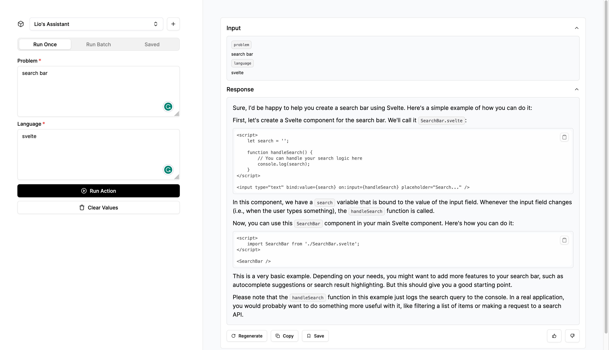

<a href="https://klu-nextjs.vercel.app/">
  
  <h1 align="center">Klu SDK Next.js Example App</h1>
</a>

<p align="center">
  An example of Klu SDK using Next.js app to interact with your Klu's actions
</p>

<p align="center">
  <a href="https://github.com/klu-ai/klu-nextjs"></a>
</p>

<p align="center">
  <a href="#introduction"><strong>Introduction</strong></a> ·
  <a href="#deploy-your-own"><strong>Deploy Your Own</strong></a> ·
  <a href="#setting-up-locally"><strong>Setting Up Locally</strong></a> ·
  <a href="#contributing"><strong>Contributing</strong></a> ·
</p>
<br/>

## Introduction

This is a Klu SDK Next.js example app to interact with your Klu's actions.

## Deploy your own

You can deploy your own version of this app by clicking this button:

[](https://vercel.com/new/clone?repository-url=https%3A%2F%2Fgithub.com%2Fklu-ai%2Fklu-nextjs&env=KLU_API_KEY,NEXT_PUBLIC_KLU_ACTION_GUID&envDescription=Klu%20API%20Key&envLink=https%3A%2F%2Fdocs.klu.ai%2Fresources%2Fapi-basics%23authentication&project-name=klu-sdk-example-app&repository-name=klu-sdk-example-app&demo-title=Klu%20SDK%20Example%20App&demo-description=An%20example%20of%20Klu%20SDK%20using%20Next.js%20app%20to%20interact%20with%20Klu's%20actions&demo-url=https%3A%2F%2Fklu-nextjs.vercel.app%2F&demo-image=https%3A%2F%2Fklu-nextjs.vercel.app%2Fog.png)

## Setting Up Locally

To set up the app locally, you'll need to clone the repository and set up the following environment variables:

- `KLU_API_KEY` – your Klu API key (you can get one [here](https://platform.openai.com/account/api-keys))
- `NEXT_PUBLIC_KLU_ACTION_GUID` - your initial action GUID (you can add and save locally more in the app)

Then, run the development server:

```bash
npm run dev
# or
yarn dev
# or
pnpm dev
```

## Contributing

Here's how you can contribute:

- [Open an issue](https://github.com/klu-ai/klu-nextjs/issues) if you believe you've encountered a bug.
- Make a [pull request](https://github.com/klu-ai/klu-nextjs/pull) to add new features/make quality-of-life improvements/fix bugs.
